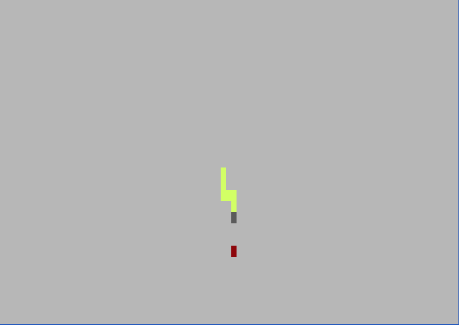

# Snake Client Project

Snake game is a very popular video game. It is a video game concept where the player maneuvers a dot and grows it by ‘eating’ pieces of food. As it moves and eats, it grows and the growing snake becomes an obstacle to smooth maneuvers. The goal is to grow it to become as big as possible without bumping into the side walls, or bumping into itself, upon which it dies.

This is simply a multiplayer take on the genre.

Before you can run this client, you will need to be running the server side. Please follow the instructions below to set up a game server and a client in separate windows.

## Final Product



## Getting Started

- Follow steps in installation to create the game server and the client separately
- Run the snake client using the `node play.js` command from snake-client
- Use the keys 'w', 'a', 's', 'd' to move up, left, down and right, respectively.
- Use the keys 't', 'u' and 'o' to display a cheeky message to others.
- Use ctrl + c to quit.

# 🐍 Snek.js [](https://opensource.org/licenses/MIT) [](https://www.npmjs.com/package/snekjs)

A terminal-based Snake implementation written in JavaScript (Node.js).


## Installation

To play the game, one needs to implement the game server. In one terminal window...

```bash

# clone the repository
git clone https://github.com/MSimnes/snake-client.git

cd server

# install and run via npm
npm install
npm run play
```

## Instructions

To play the game, one needs to implement a game client. In a second terminal window... 

```bash

cd snake-client
node play.js


```

## Acknowledgements

This project was not built from scratch. It was inspired and started from [snek](https://github.com/taniarascia/snek) ([blog post](https://www.taniarascia.com/snake-game-in-javascript/)). [Tania Rascia](https://www.taniarascia.com) is the original author.

## License

This project is open source and available under the [MIT License](LICENSE).